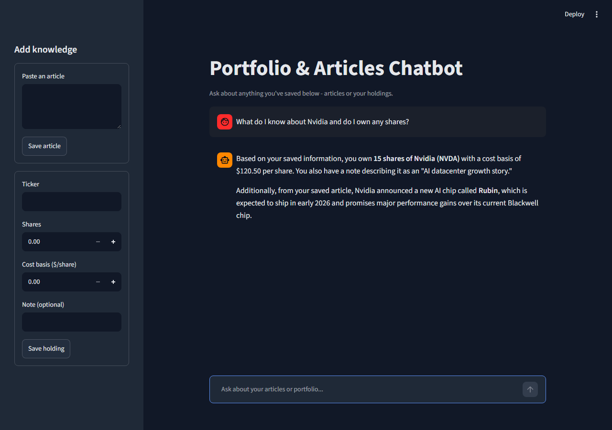

# Market email project

A small collection of stock market tools, growing piece by piece.

## What's here so far

### `ticker.py` - CLI stock ticker
Prints live price, daily change, and recent headlines for a list of tickers using `yfinance`.
```bash
python ticker.py AAPL MSFT TSLA
```

### `app.py` - local refresh-to-update web page
A tiny Flask page (black background, terminal-style) showing live price/news for AAPL, MSFT, and GOOGL. Hit refresh in the browser to pull fresh data.
```bash
python app.py
# open http://127.0.0.1:5000
```

### `chatbot_app.py` - portfolio & articles chatbot
A capstone-style RAG chatbot (Streamlit UI, navy theme) backed by DeepSeek. You can save articles and stock portfolio holdings through the sidebar, then ask questions - it retrieves the most relevant saved notes (TF-IDF similarity) and blends them into the answer.
```bash
streamlit run chatbot_app.py
```
Needs a `DEEPSEEK_API_KEY` in a local `.env` file (see `.env.example`).

Want to try it with something in it right away instead of an empty sidebar? Run:
```bash
python seed_demo_data.py
```
This loads a diversified fake portfolio (AAPL, MSFT, NVDA, TSLA, GOOGL, VOO, BND) plus a handful of real, dated July 2026 market articles, so you can ask things like *"given the recent news, how are my AI holdings doing?"* right out of the gate.

**Use cases this is aimed at:**
- Portfolio Q&A - "what do I own in AI stocks?", "what's my cost basis on NVDA?"
- News-aware answers - cross-referencing a saved article against your actual holdings
- Risk/diversification checks - "am I overweight tech?"
- Daily digest - summarizing saved articles relevant to what you hold
- Cost-basis/tax-lot memory - jot down *why* you bought something, retrievable later



## Updates

**Latest:**
- Fixed low-contrast chat text in `chatbot_app.py` - moved theming from an inline CSS hack to proper Streamlit theming (`.streamlit/config.toml`), which actually cascades into chat bubbles/sidebar/buttons
- Added `seed_demo_data.py` to pre-load a fake diversified portfolio + real July 2026 market articles, so the chatbot has something to work with immediately
- New legible screenshot (`docs/chatbot_screenshot_v2.png`); the original is kept in `docs/` for reference

**Earlier:**
- Added the RAG chatbot itself (`chatbot_app.py`, `rag_store.py`, `deepseek_client.py`) with tests
- Added `app.py`, a local refresh-to-update web page for live stock price/news
- Added `ticker.py`, a CLI stock price/news ticker, with tests

## Setup
```bash
python -m venv venv
venv\Scripts\activate
pip install -r requirements-dev.txt
pytest tests/
```
