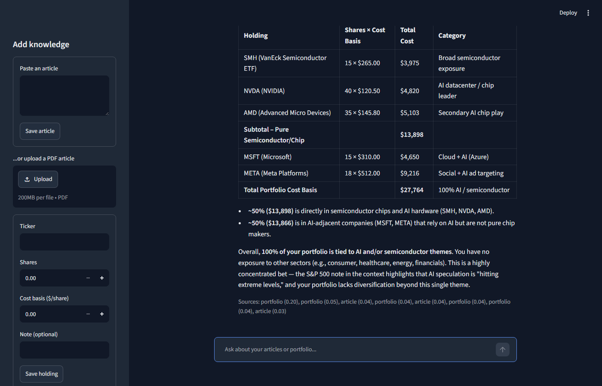
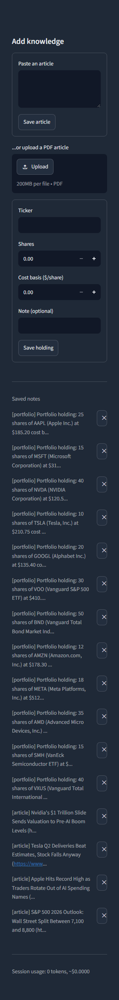

# Market email project


A small collection of stock market tools, growing piece by piece.

## What's here so far

### `ticker.py` - CLI stock ticker
Prints live price, daily change, and recent headlines for a list of tickers using `yfinance`.
```bash
python ticker.py AAPL MSFT TSLA
```

### `app.py` - local refresh-to-update web page
A tiny Flask page (black background, terminal-style) showing live price/news for AAPL, MSFT, and GOOGL. Hit refresh in the browser to pull fresh data.
```bash
python app.py
# open http://127.0.0.1:5000
```

### `chatbot_app.py` - portfolio & articles chatbot
A capstone-style RAG chatbot (Streamlit UI, navy theme) backed by DeepSeek. You can save articles (pasted text or PDF upload) and stock portfolio holdings through the sidebar, then ask questions - it retrieves the most relevant saved notes (TF-IDF similarity) and blends them into the answer, citing which notes it used. The sidebar also lists everything you've saved so far, with a one-click delete, and tracks token usage/estimated cost for the session.
```bash
streamlit run chatbot_app.py
```
Needs a `DEEPSEEK_API_KEY` in a local `.env` file (see `.env.example`).

Want to try it with something in it right away instead of an empty sidebar? Run:
```bash
python seed_demo_data.py
```
This loads a diversified fake portfolio (AAPL, MSFT, NVDA, TSLA, GOOGL, VOO, BND, AMZN, META, AMD, SMH, VXUS) plus a handful of real, dated July 2026 market articles, so you can ask things like *"given the recent news, how are my AI holdings doing?"* right out of the gate.

**Use cases this is aimed at:**
- Portfolio Q&A - "what do I own in AI stocks?", "what's my cost basis on NVDA?"
- News-aware answers - cross-referencing a saved article against your actual holdings
- Risk/diversification checks - "am I overweight tech?"
- Daily digest - summarizing saved articles relevant to what you hold
- Cost-basis/tax-lot memory - jot down *why* you bought something, retrievable later

Answers cross-reference multiple holdings and articles at once, not just a single match:



Saved notes are listed in the sidebar with a delete button for each, so the store doesn't just grow forever:



Not deployed anywhere yet - [`DEPLOYMENT.md`](DEPLOYMENT.md) has the checklist for putting this on Streamlit Community Cloud whenever that's worth doing.

## Updates

**Latest:**
- Grew the demo portfolio from 7 to 12 holdings (added AMZN, META, AMD, SMH, VXUS) to stress-test retrieval with a bigger note set
- Bumped `RagStore.retrieve`'s `top_k` from 4 to 8 - with more than a handful of saved notes, 4 was cutting off holdings that should've been in scope for broader questions like "am I overweight tech?"
- Added `DEPLOYMENT.md`, a checklist for deploying to Streamlit Community Cloud (not deployed yet, just ready to go)
- New screenshots (`docs/chatbot_screenshot_v4.png`, `docs/chatbot_sidebar_full_portfolio.png`) showing the larger dataset; older ones kept in `docs/` for reference

**Earlier:**
- Sidebar now lists every saved article/holding with a delete button, instead of add-only
- Re-saving a holding for a ticker you already have updates it in place rather than creating a duplicate
- PDF upload as an alternative to pasting article text, ticker-to-company-name lookup on portfolio holdings, per-session token/cost tracking, and source citations on answers
- Added a GitHub Actions workflow to run the test suite on push/PR
- Fixed low-contrast chat text in `chatbot_app.py` - moved theming from an inline CSS hack to proper Streamlit theming (`.streamlit/config.toml`), which actually cascades into chat bubbles/sidebar/buttons
- Added `seed_demo_data.py` to pre-load a fake diversified portfolio + real July 2026 market articles, so the chatbot has something to work with immediately
- Added the RAG chatbot itself (`chatbot_app.py`, `rag_store.py`, `deepseek_client.py`) with tests
- Added `app.py`, a local refresh-to-update web page for live stock price/news
- Added `ticker.py`, a CLI stock price/news ticker, with tests

## Setup
```bash
python -m venv venv
venv\Scripts\activate
pip install -r requirements-dev.txt
pytest tests/
```
