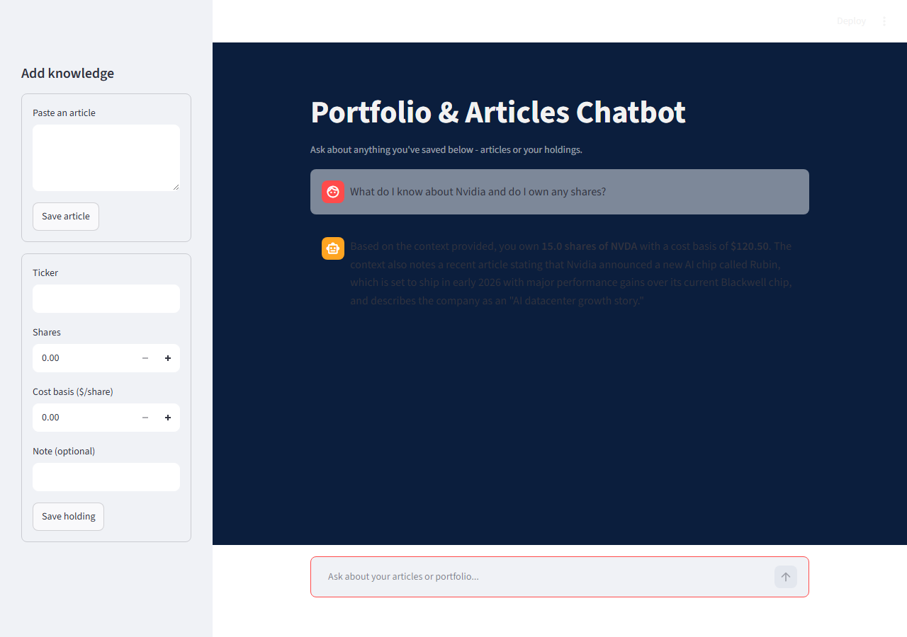

# Market email project

A small collection of stock market tools, growing piece by piece.

## What's here so far

### `ticker.py` - CLI stock ticker
Prints live price, daily change, and recent headlines for a list of tickers using `yfinance`.
```bash
python ticker.py AAPL MSFT TSLA
```

### `app.py` - local refresh-to-update web page
A tiny Flask page (black background, terminal-style) showing live price/news for AAPL, MSFT, and GOOGL. Hit refresh in the browser to pull fresh data.
```bash
python app.py
# open http://127.0.0.1:5000
```

### `chatbot_app.py` - portfolio & articles chatbot
A capstone-style RAG chatbot (Streamlit UI, navy theme) backed by DeepSeek. You can save articles and stock portfolio holdings through the sidebar, then ask questions - it retrieves the most relevant saved notes (TF-IDF similarity) and blends them into the answer.
```bash
streamlit run chatbot_app.py
```
Needs a `DEEPSEEK_API_KEY` in a local `.env` file (see `.env.example`).



## Setup
```bash
python -m venv venv
venv\Scripts\activate
pip install -r requirements-dev.txt
pytest tests/
```
